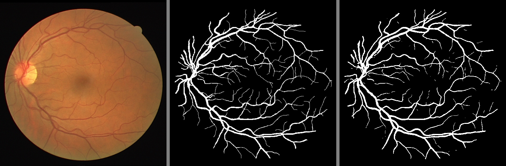

# Retinal-vessel-segmentation

## 项目简介
Retinal-vessel-segmentation 是一个基于 UNet 的视网膜血管分割项目，采用了 DRIVE 数据集进行训练和测试。项目使用 PyTorch 框架实现，提供了从数据准备到模型训练和测试的完整流程。通过运行本项目，可以获得视网膜血管的分割结果图。


## 特性
- 使用 UNet 架构完成视网膜血管分割
- 提供 DRIVE 数据集的处理和模型训练、测试脚本
- 自动生成分割结果图，包含原图、标注掩码 (mask) 和预测掩码的拼接图
- 基于 MIT 协议开源

## 示例结果
下图展示了模型的测试结果，其中包括原图、标注掩码和预测掩码的拼接图：




## 环境要求
- **操作系统**: Windows
- **Python 版本**: 3.12
- **深度学习框架**: PyTorch 2.5.1 + cu121


## 安装与使用

### 1. 克隆项目
```bash
git clone https://github.com/MilleXi/Retinal-vessel-segmentation.git
cd Retinal-vessel-segmentation
```

### 2. 安装依赖
建议创建虚拟环境后安装依赖：
```bash
python -m venv .venv
.\.venv\\Scripts\activate  # 激活虚拟环境
pip install -r requirements.txt
```

### 3. 数据准备
解压仓库中提供的 `DRIVE.zip` 数据集：
```bash
unzip DRIVE.zip
```

运行 `dataset.py`，生成用于训练的数据：
```bash
python dataset.py
```
生成的 `data` 文件夹将包含处理后的数据。

### 4. 模型训练
运行 `train.py` 开始训练模型：
```bash
python train.py
```
训练好的模型权重将保存在 `files` 文件夹下。

### 5. 模型测试
运行 `test.py` 测试模型：
```bash
python test.py
```
测试结果图（原图、原始掩码和预测掩码拼接图）将保存在 `results` 文件夹中。


## 文件说明
- **`dataset.py`**: 数据集预处理脚本，将原始 DRIVE 数据集转换为模型训练所需格式。
- **`train.py`**: 模型训练脚本，保存训练好的权重到 `files` 文件夹。
- **`test.py`**: 模型测试脚本，生成结果图并保存到 `results` 文件夹。
- **`files/`**: 用于存储模型训练时生成的检查点文件（checkpoints）。
- **`results/`**: 用于存储模型预测生成的结果图。


## 数据集
项目使用 [DRIVE 数据集](https://drive.grand-challenge.org/) 进行训练和测试。该数据集已包含在项目中，无需单独下载。


## 授权协议
本项目基于 MIT 许可证开源。详细内容请参见 [LICENSE](LICENSE) 文件。

